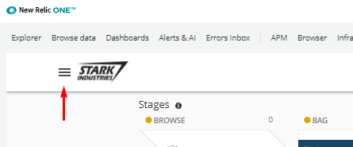
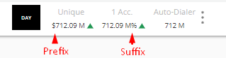
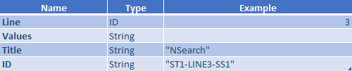
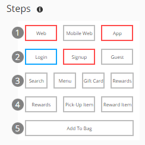

## Pathpoint Configuration File
  

The configuration of pathpoint is managed by a powerful JSON configuration file that let's us add and configure stages, steps, and touchpoints. The file can be uploaded and downloaded directly from the Pathpoint UI.

### Uploading a New Config File

Pathpoint ofrece la posibilidad de cargar el archivo de configuración a través de la siguiente opción.

1. Dirigirse al menú de la parte superior izquierda  
  
2. Ingresar a la opción "Configuración JSON"  
  
3. Posteriormente seleccionar "Actualizar"  
  
4. Ubicar el archivo que desea actualizar y cargar  
  
5. Finalmente se visualiza el pathopint con la última actualización cargada. 

   

### Downloading the Currently Active Config File

De igual manera Pathpoint brinda la posibilidad de poder descargar el archivo de configuración a través de la siguiente opción.

1. Dirigirse al menú de la parte superior izquierda  
  
2. Ingresar a la opción "Configuración JSON"  
  
3. Posteriormente seleccionar la opción disponible para descargar "Pathpoint_json_vx"  
  
4. Alojar el archivo en la ubicación que desee  
  
5. Finalmente el archivo se descarga para su consulta  
  

### JSON Format Explained
JSON for its acronym (JavaScript Object Notation) is a data structure, whose basic function is to allow the exchange of information. Through this structure it will be possible to identify each of the elements and components that will facilitate the implementation of Pathpoint, knowing the function of its attributes, queries and data output.

#### 1. KPI
KPI by its acronym (Key Performance Indicator), are normally known as key indicators, which allow knowing the performance of a process. In the case of Pathpoint, KPIs fulfill a fundamental function, which is the measurement of specific indicators within a particular process. 

#### - Structure KPI

    "kpis": [
        	{
		    "type": 101,
		    "name": "Unique Visitors",
		    "shortName": "Unique",
		    "link": "https://onenr.io/01qwL8KPxw5",
		    "query": "SELECT count(*) as value  FROM  Public_APICall COMPARE WITH 2 day ago",
		    "value_type": "FLOAT",
		    "prefix": "$",
		    "suffix": ""
        	}
	    ]

Where:

 - ***Type***: *Defines the type of measurement to be performed, which can be:  
 -- "100" returns the current measurement value.  
 -- "101" returns the current value and compares it with the value of "X" previous days*
 - ***Name***: *Corresponds to the long name of the KPI.*
 - ***ShortName***: *Corresponds to the short name of the KPI.*  
    
 - ***Link***: *Corresponds to the link that directs to the KPI dashboard.*  
    
 - ***Query***: *Corresponds to the query that is used to perform the measurement*. 
 - ***Value_type***: *It can be an integer value "INT" (example: 100) or a decimal value "FLOAT" (example: 100,2)*.  
    
 - ***Prefix***: *It is used in the case in which you want to Identify the KPI by placing a symbol or letter at the beginning of the name. Example: USD 12000*
 - ***Suffix***: *It is used in the case where you want to Identify the KPI by adding a symbol or letter at the end of the name. Example: 5%*.
   
    

#### - Example KPI

#### - KPI Pathpoint Image

#### 2. Stages  
Here you can see the business stages at a high level. For each commercial stage, different services and methods are presented at the system level. Based on business information, PathPoint previews latency indicators.
All the information related to the stage, including the errors for each one of them, allows to detail certain aspects at a high level.

#### - Structure Stage

	"stages": 
	[
           {
            "title": "BROWSE",
            "active_dotted": "none",
            "arrowMode": "FLOW",
            "percentage_above_avg": 20,
	    	"steps": 
		 [
		  "Code steps..."
		 ]
		    "touchpoints": 
			[
			   "Code touchpoints..."
			]
	   }
	 ]
	  
	  
Where:
 - ***Title***: *Corresponds to the name that identifies the stage* 
 - ***active_dotted***: *explicar...*
 - ***arrowMode***: *explicar ¿que significa cada estilo de flecha?..."flow", "static"*
 - ***percentage_above_avg***: *Indicates the percentage that is above the mean*

#### - Examples stage   
Example 1  

  
Example 2  
  

#### - Stage Image

#### 3. Steps
These are "sub-stages" of a main stage and represent a certain degree of granularity in your services. When you click on any of the steps, even more detailed services and functions will be displayed in the list of associated TouchPoints. When a stage has a red border, it means that there is an error type anomaly for that stage.

A step contains one or more contact points. Each step allows business stakeholders to understand the performance of the system in some way without going into all the implementation details.

#### - Structure Steps

	"steps": [
                  {
                    "line": 1,
                    "values": 
		     [
                        {
                            "title": "Web",
                            "id": "ST1-LINE1-SS1"
                        },
                        {
                            "title": "Mobile Web",
                            "id": "ST1-LINE1-SS2"
                        },
                        {
                            "title": "App",
                            "id": "ST1-LINE1-SS3"
                        }
		     ]
		   }
                 ]

Where:
- ***Line***: *Positions the row in which the task is located within the stage.* 
- ***Values***: *Indicate the parameters for each step.*
- ***Title***: *Corresponds to the name with which the step is identified.*
- ***ID***: *Corresponds to the code that identifies the step in its order within the row that is located.*

#### - Examples Steps
Example 1  

  
Example 2  
  

#### - Steps Images

#### 4. Touchpoints
[TBD]
  

### Different Touchpoint Types Explained

 [TBD]
  

### Example JSON Files for Different Business Sectors
- Basic E-Commerce
[TBD]
- Streaming Media
[TBD]
- Shipping & Logistics
[TBD]
- OTHER (check with Federico)
[TBD]
